# Mine Survivors ⛏️💀

**Mine Survivors** to dynamiczna gra typu survival inspirowana tytułami takimi jak *Vampire Survivors*. Wciel się w górnika eksplorującego tajemnicze podziemne tunele, gdzie musisz przetrwać nieskończone fale przeciwników, zdobywać doświadczenie i ulepszać swoje umiejętności.

## 📚 Spis treści

- [Opis projektu](#opis-projektu)
- [Cel projektu 🎯](#cel-projektu-)
- [Stack technologiczny 💻](#stack-technologiczny-)
- [Mechaniki rozgrywki 🎮](#mechaniki-rozgrywki-)
- [Interfejs użytkownika (UI) 🖥️](#interfejs-użytkownika-ui-)
- [Programowanie obiektowe w praktyce 🏗️](#programowanie-obiektowe-w-praktyce-)
- [Diagram UML architektury 📊](#diagram-uml-architektury-)
- [Instalacja i uruchomienie 🚀](#instalacja-i-uruchomienie-)
- [Aktualizacje / Rozwój 📈](#aktualizacje--rozwój-)
- [Licencja 📄](#licencja-)

## Opis projektu

**Mine Survivors** to gra survival top-down 2D, w której gracz wciela się w górnika eksplorującego niebezpieczne podziemne kopalnie. Celem jest przetrwanie jak najdłużej przeciwko falami wrogów, zdobywanie doświadczenia, awansowanie na wyższe poziomy i odblokowywanie coraz potężniejszych ulepszeń.

Gra łączy klasyczną mechanikę survival z nowoczesnym systemem progresji postaci, oferując intensywną rozgrywkę z elementami strategii i zarządzania zasobami.

## Cel projektu 🎯

- **Nauka programowania obiektowego** poprzez praktyczną implementację gry w C#
- **Demonstracja zaawansowanych zasad OOP** - dziedziczenie, polimorfizm, hermetyzacja, interfejsy
- **Rozwój portfolio** i prezentacja umiejętności w tworzeniu gier
- **Eksperymentowanie z silnikiem Godot 4.4.1** i jego możliwościami C#
- **Praktyczne zastosowanie wzorców projektowych** (Singleton, Strategy, Observer)

## Stack technologiczny 💻

- **Silnik gry:** Godot Engine 4.4.1 (Mono)
- **Język programowania:** C# (.NET)
- **Architektura:** Programowanie obiektowe z wykorzystaniem interfejsów i wzorców projektowych
- **System kontroli wersji:** Git / GitHub
- **Dokumentacja:** Markdown, komentarze w kodzie zgodne z XML Documentation
- **Grafika:** 2D top-down pixel art, OpenAI Chat GPT
- **Audio:** Efekty dźwiękowe 16-bit w stylu retro

## Mechaniki rozgrywki 🎮

### Podstawowe mechaniki
- **Sterowanie 8-kierunkowe** - płynne poruszanie się po mapie
- **System walki** - Zróżnicowane typy broni
- **System uników (dodge roll)** - szybkie unikanie ataków z czasem nietykalności
- **Progresja postaci** - zdobywanie doświadczenia i awansowanie na wyższe poziomy

### System przeciwników
- **Goblin** - szybki, agresywny przeciwnik poruszający się bezpośrednio do gracza
- **Hobgoblin** - taktyczny przeciwnik z atakiem "charge" w określonym zasięgu  
- **Golem** - wolny ale wytrzymały przeciwnik z fazowym ruchem (ruch-odpoczynek)

### System ulepszeń
Po każdym awansie gracz wybiera jedno z trzech losowych ulepszeń:
- **Prędkość** - zwiększa szybkość poruszania się
- **Obrażenia** - zwiększa siłę ataków
- **Obrona** - zmniejsza otrzymywane obrażenia
- **Zdrowie** - zwiększa maksymalne punkty życia

### Progresywna trudność
- **Dynamiczny spawning** - częstotliwość pojawiania się przeciwników wzrasta z czasem
- **Ewolucja przeciwników** - trudniejsi wrogowie pojawiają się w późniejszych fazach gry
- **Poziomy trudności** - Łatwy, Normalny, Trudny, Ekstremalny

## Interfejs użytkownika (UI) 🖥️

### Menu systemy
- **Menu Główne** - Start, Opcje, Najlepsze Wyniki, Wyjście
- **Menu Opcji** - Konfiguracja audio, grafiki i trudności z zapisem do pliku
- **Menu Pauzy** - Wstrzymanie gry, dostęp do opcji, powrót do menu
- **Menu Game Over** - Statystyki końcowe, ranking wyników, restart

### HUD (Heads-Up Display)
- **Pasek zdrowia** - wizualna reprezentacja aktualnych punktów życia
- **Pasek doświadczenia** - postęp do następnego poziomu z fioletowym motywem
- **Statystyki** - czas przeżycia, liczba zabitych wrogów, aktualny poziom
- **Menu Level Up** - wybór ulepszeń po awansie

### System zapisów
- **High Scores** - ranking 10 najlepszych wyników z szczegółowymi statystykami
- **Ustawienia** - automatyczny zapis konfiguracji gracza
- **Postęp gry** - tracking statystyk i osiągnięć

## Programowanie obiektowe w praktyce 🏗️

Projekt **Mine Survivors** jest kompleksną demonstracją zaawansowanych technik programowania obiektowego w praktyce. Każda z kluczowych zasad OOP została świadomie zastosowana i zaimplementowana.

### 🔐 Hermetyzacja (Encapsulation)

**Kontrolowany dostęp do danych** - wszystkie kluczowe właściwości są chronione przed niepożądaną modyfikacją:

```csharp
// Player.cs - Hermetyzacja statystyk gracza
[Export] public float BaseSpeed = 200f;      // Publiczne dla edytora
public float SpeedBonus { get; private set; } // Tylko odczyt z zewnątrz
public float TotalSpeed => BaseSpeed + SpeedBonus; // Obliczana właściwość

// Kontrolowany sposób modyfikacji
public void AddSpeedBonus(float bonus) {
    SpeedBonus += bonus;
    GD.Print($"Speed bonus: +{bonus}. Total speed: {TotalSpeed}");
}
```

**Ukrywanie implementacji** - szczegóły działania są niewidoczne dla klientów:

```csharp
// OptionsMenu.cs - Hermetyzacja logiki ustawień
private float _masterVolume = 1.0f;
private float _musicVolume = 0.8f;

private void ApplyAudioSettings() {
    // Kompleksowa logika zastosowania dźwięku ukryta w metodzie
    var masterBusIndex = AudioServer.GetBusIndex("Master");
    AudioServer.SetBusVolumeDb(masterBusIndex, LinearToDb(_masterVolume));
}
```

### 🧬 Dziedziczenie (Inheritance)

**Hierarchia klas z wspólną funkcjonalnością** - klasy pochodne rozszerzają możliwości bazowych:

```csharp
// Enemy.cs - Klasa bazowa dla wszystkich przeciwników
public partial class Enemy : CharacterBody2D, IDamageable, IAttack
{
    [Export] public float MaxHealth { get; set; } = 50f;
    [Export] public float MoveSpeed { get; set; } = 100f;
    
    // Metoda wirtualna - może być nadpisana w klasach pochodnych
    protected virtual Vector2 CalculateMovement(Vector2 targetPosition) {
        Vector2 direction = (targetPosition - GlobalPosition).Normalized();
        return direction * MoveSpeed;
    }
}

// Goblin.cs - Konkretna implementacja przeciwnika
public partial class Goblin : Enemy
{
    protected override Vector2 CalculateMovement(Vector2 targetPosition) {
        Vector2 direction = (targetPosition - GlobalPosition).Normalized();
        float goblinSpeed = MoveSpeed * 1.2f; // 20% szybszy
        return direction * goblinSpeed;
    }
}
```

### 🎭 Polimorfizm (Polymorphism)

**Jedna interfejs, wiele implementacji** - różne obiekty reagują różnie na te same operacje:

```csharp
// Weapon.cs - Abstrakcyjna klasa bazowa
public abstract partial class Weapon : Node2D, IAttack
{
    protected abstract bool ExecuteAttack(); // Każda broń atakuje inaczej
}

// Bow.cs - Konkretna implementacja łuku
protected override bool ExecuteAttack() {
    var arrow = _arrowScene.Instantiate<Arrow>();
    arrow.Initialize(_arrowSpeed, Damage);
    GetTree().CurrentScene.AddChild(arrow);
    return true;
}

// Użycie polimorfizmu - nie wiemy jakiej konkretnej broni używamy
weapon.PerformAttack(target); // Każda broń wykona swój unikalny atak
```

**Polimorficzne zachowanie przeciwników**:

```csharp
// EnemySpawner.cs - Różne typy przeciwników traktowane jednakowo
List<Enemy> enemies = new List<Enemy> {
    new Goblin(),    // Szybki i agresywny
    new Hobgoblin(), // Taktyczny z charge attack
    new Golem()      // Wolny ale wytrzymały
};

// Każdy przeciwnik porusza się zgodnie ze swoją strategią
foreach(Enemy enemy in enemies) {
    enemy.CalculateMovement(playerPosition); // Polimorfizm w akcji!
}
```

### 🔌 Interfejsy (Interfaces)

**Kontrakty behawioralne** - gwarantują spójność implementacji:

```csharp
// IDamageable.cs - Wszystko co może otrzymać obrażenia
public interface IDamageable
{
    float MaxHealth { get; }
    float CurrentHealth { get; }
    bool IsAlive { get; }
    void TakeDamage(float damage);
}

// IAttack.cs - Wszystko co może atakować
public interface IAttack
{
    float Damage { get; }
    bool CanAttack { get; }
    float PerformAttack(IDamageable target);
}

// Praktyczne zastosowanie - Arrow wie jak zadać obrażenia każdemu obiektowi
if (body is IDamageable damageable) {
    damageable.TakeDamage(_damage); // Polimorfizm przez interfejs
}
```

### 🏗️ Wzorce projektowe (Design Patterns)

**Singleton Pattern** - jeden GameManager w całej grze:

```csharp
// GameManager.cs - Centralny punkt zarządzania
public partial class GameManager : Node2D
{
    public static GameManager Instance { get; private set; }
    
    public override void _Ready() {
        if (Instance != null) {
            QueueFree(); // Zabezpieczenie przed duplikatami
            return;
        }
        Instance = this;
    }
}
```

**Observer Pattern** - komunikacja przez sygnały:

```csharp
// Player.cs - Wydawca zdarzeń
[Signal] public delegate void LevelUpEventHandler(int newLevel);
[Signal] public delegate void HealthChangedEventHandler(float current, float max);

// HUD.cs - Subskrybent zdarzeń
private void ConnectToPlayer() {
    player.HealthChanged += OnPlayerHealthChanged;
    player.LevelUp += OnPlayerLevelUp;
}
```

### 🧩 Kompozycja (Composition)

**Składanie funkcjonalności** zamiast dziedziczenia:

```csharp
// Bow.cs używa Arrow jako niezależny komponent
protected override bool ExecuteAttack() {
    var arrow = _arrowScene.Instantiate<Arrow>(); // Kompozycja
    arrow.Initialize(_arrowSpeed, Damage);
    // Łuk "ma" strzałę, ale nie "jest" strzałą
}

// LevelUpManager.cs używa opcji ulepszeń
public struct UpgradeOption {
    public string Name;
    public UpgradeType Type;
    public float Value;
}
// Manager "ma" opcje, ale nie dziedziczy po nich
```

### 📊 Przykłady praktycznego zastosowania OOP

**1. System przeciwników** - każdy typ ma unikalne zachowanie:
- `Goblin` - prosty, szybki ruch
- `Hobgoblin` - złożona strategia z charge attack
- `Golem` - fazowy ruch z timerami Godot

**2. System broni** - różne mechanizmy ataku:
- `Bow` + `Arrow` - atak dystansowy z pociskami
- Wspólny interfejs `IAttack` dla wszystkich broni

**3. System UI** - modularne menu:
- `MainMenu`, `OptionsMenu`, `PauseMenu` - każde odpowiedzialne za swoją funkcjonalność
- Hermetyzacja logiki w każdej klasie

## Diagram UML architektury 📊

Poniższy diagram przedstawia kompletną architekturę projektu **Mine Survivors** z wykorzystaniem wszystkich zasad programowania obiektowego:

```mermaid
classDiagram
    %% ===== INTERFEJSY =====
    class IDamageable {
        <<interface>>
        +float MaxHealth
        +float CurrentHealth
        +bool IsAlive
        +TakeDamage(float damage)
    }
    
    class IAttack {
        <<interface>>
        +float Damage
        +bool CanAttack
        +PerformAttack(IDamageable target)
    }

    %% ===== PLAYER SYSTEM =====
    class Player {
        -float BaseSpeed
        -float SpeedBonus
        -float CurrentHealth
        -PlayerState _currentState
        +TotalSpeed
        +AddSpeedBonus(float bonus)
        +TakeDamage(float damage)
        +GainExperience(float amount)
        #CalculateMovement()
    }

    %% ===== ENEMY SYSTEM =====
    class Enemy {
        <<abstract>>
        +float MaxHealth
        +float MoveSpeed
        +float Damage
        -Player _player
        +TakeDamage(float damage)
        +PerformAttack(IDamageable target)
        #CalculateMovement(Vector2 target)*
    }

    class Goblin {
        +CalculateMovement(Vector2 target)
        %% Agresywny, 20% szybszy
    }

    class Hobgoblin {
        -bool _isCharging
        -float _chargeRange
        +CalculateMovement(Vector2 target)
        %% Charge attack w zasięgu
    }

    class Golem {
        -bool _isMoving
        -Timer _moveTimer
        -Timer _restTimer
        +CalculateMovement(Vector2 target)
        %% Fazowy ruch: ruch-odpoczynek
    }

    %% ===== WEAPON SYSTEM =====
    class Weapon {
        <<abstract>>
        +float Damage
        +float Cooldown
        -float _cooldownTimer
        +PerformAttack(IDamageable target)
        #ExecuteAttack()*
    }

    class Bow {
        -float _arrowSpeed
        -PackedScene _arrowScene
        +ExecuteAttack()
        %% Tworzy Arrow i wystrzeliwuje
    }

    class Arrow {
        -float _speed
        -float _damage
        -float _travelledDistance
        +Initialize(float speed, float damage)
        +OnBodyEntered(Node2D body)
    }

    %% ===== MANAGER SYSTEM =====
    class GameManager {
        <<Singleton>>
        +static GameManager Instance
        -GameState _currentState
        -float _survivalTime
        -int _enemiesKilled
        +StartNewGame()
        +TogglePause()
        +RegisterEnemyKill()
        +AddExperience(float amount)
    }

    class LevelUpManager {
        -List~UpgradeOption~ _allUpgrades
        -Player _player
        +ShowLevelUpMenu(List options)
        +ApplyUpgradeToPlayer(UpgradeOption upgrade)
        +TriggerLevelUp()
    }

    class EnemySpawner {
        -PackedScene _goblinScene
        -PackedScene _hobgoblinScene
        -PackedScene _golemScene
        -Timer _spawnTimer
        +ChooseEnemyType()
        +SpawnEnemy(PackedScene scene, Vector2 pos)
    }

    class ScoreManager {
        <<Autoload>>
        -List~GameResult~ _scores
        +AddScore(float time, int kills, int level)
        +GetTopScores()
        +IsHighScore(int score)
    }

    %% ===== UI SYSTEM =====
    class MainMenu {
        -Button _startButton
        -Button _optionsButton
        +OnStartButtonPressed()
        +TransitionToScene(string path)
    }

    class GameOverMenu {
        -Label _scoreLabel
        -Button _restartButton
        +ShowGameOver(float time, int kills, float exp, int level)
        +CalculateScore()
    }

    class LevelUpMenu {
        -Button _option1Button
        -Button _option2Button
        -Button _option3Button
        +ShowUpgradeOptions(List options)
        +OnOptionSelected(int index)
    }

    class Hud {
        -ProgressBar _healthBar
        -ProgressBar _expBar
        -Label _timeLabel
        +UpdateSurvivalTime(float time)
        +OnPlayerHealthChanged(float current, float max)
    }

    %% ===== DATA CLASSES =====
    class GameResult {
        +string Timestamp
        +float SurvivalTime
        +int EnemiesKilled
        +int FinalScore
        +GetFormattedTime()
        +CalculateScore()
    }

    class UpgradeOption {
        <<struct>>
        +string Name
        +UpgradeType Type
        +float Value
        +string Description
    }

    %% ===== RELACJE DZIEDZICZENIA =====
    IDamageable <|.. Player : implements
    IDamageable <|.. Enemy : implements
    IAttack <|.. Player : implements
    IAttack <|.. Enemy : implements
    IAttack <|.. Weapon : implements

    Enemy <|-- Goblin : extends
    Enemy <|-- Hobgoblin : extends
    Enemy <|-- Golem : extends

    Weapon <|-- Bow : extends

    %% ===== RELACJE KOMPOZYCJI =====
    Player "1" --> "1" Bow : has
    Bow "1" --> "*" Arrow : creates
    
    GameManager "1" --> "1" Player : manages
    GameManager "1" --> "1" LevelUpManager : uses
    GameManager "1" --> "1" EnemySpawner : uses
    
    LevelUpManager "1" --> "*" UpgradeOption : uses
    EnemySpawner "1" --> "*" Enemy : spawns
    ScoreManager "1" --> "*" GameResult : stores
    
    Hud "1" --> "1" Player : observes
    LevelUpMenu "1" --> "1" LevelUpManager : communicates
```



### 🔍 Opis diagramu

**Interfejsy (<<interface>>):**
- `IDamageable` - wszystko co może otrzymać obrażenia
- `IAttack` - wszystko co może atakować

**Klasy abstrakcyjne (<<abstract>>):**
- `Enemy` - bazowa klasa dla wszystkich przeciwników
- `Weapon` - bazowa klasa dla wszystkich broni

**Wzorce projektowe:**
- `GameManager` - **Singleton** zarządzający grą
- `ScoreManager` - **Autoload** (Godot Singleton) dla wyników

**Relacje:**
- **Dziedziczenie** (`<|--`) - Goblin/Hobgoblin/Golem extends Enemy
- **Implementacja** (`<|..`) - Player/Enemy implements IDamageable
- **Kompozycja** (`-->`) - GameManager "ma" Player, Bow "tworzy" Arrow
- **Obserwacja** - HUD obserwuje Player przez sygnały

## Instalacja i uruchomienie 🚀

### Wymagania systemowe
- **Godot Engine 4.4.1** z obsługą C# (Mono)
- **.NET SDK** w wersji kompatybilnej z Godot
- **System operacyjny:** Windows 10+, macOS 10.15+, lub Linux

### Kroki instalacji

1. **Sklonuj repozytorium:**
   ```bash
   git clone https://github.com/twoj-username/mine-survivors.git
   cd mine-survivors
   ```

2. **Otwórz projekt w Godot:**
   - Uruchom Godot Engine 4.4.1
   - Kliknij "Import" i wybierz plik `project.godot`
   - Upewnij się, że projekt rozpoznaje C# (powinien automatycznie zbuilować)

3. **Konfiguracja C#:**
   - Godot automatycznie utworzy pliki `.csproj`
   - Poczekaj na zakończenie kompilacji

4. **Uruchom grę:**
   - Naciśnij F5 w Godot lub kliknij przycisk Play
   - Wybierz scenę główną jeśli zostanie o to zapytany

### Struktura projektu
```
mine-survivors/
├── scenes/          # Sceny Godot (.tscn)
│   ├── UI/         # Interfejsy użytkownika
│   ├── enemies/    # Przeciwnicy
│   └── weapons/    # Bronie
├── scripts/        # Kod C#
│   ├── player/     # System gracza
│   ├── enemies/    # System przeciwników  
│   ├── weapons/    # System broni
│   ├── managers/   # Managery gry
│   ├── interfaces/ # Interfejsy
│   └── ui/         # Logika UI
├── assets/         # Grafiki, dźwięki
└── project.godot   # Główny plik projektu
```
### Screeny z Projektu

## Aktualizacje / Rozwój 📈

### ✅ Zaimplementowane funkcjonalności

**Fundament projektu:**
- ✅ Konfiguracja projektu Godot 4.4.1 z C#
- ✅ Integracja z Git/GitHub
- ✅ Struktura katalogów i namespace'ów

**System gracza:**
- ✅ Klasa `Player` z pełnym systemem ruchu
- ✅ System zdrowia z hermetyzacją
- ✅ Dodge roll z nietykalności
- ✅ State Machine (Normal, Rolling, Hurt, Dead)

**System przeciwników:**
- ✅ Abstrakcyjna klasa `Enemy` z polimorfizmem
- ✅ `Goblin` - agresywny przeciwnik
- ✅ `Hobgoblin` - taktyczny z charge attack
- ✅ `Golem` - wolny z fazowym ruchem

**System broni:**
- ✅ Abstrakcyjna klasa `Weapon`
- ✅ `Bow` + `Arrow` - system pocisków
- ✅ Polimorficzny system ataku

**Interfejsy użytkownika:**
- ✅ `MainMenu` - menu główne
- ✅ `OptionsMenu` - pełna konfiguracja ustawień
- ✅ `PauseMenu` - pauza w grze
- ✅ `GameOverMenu` - statystyki końcowe
- ✅ `LevelUpMenu` - wybór ulepszeń
- ✅ `HighScoresMenu` - ranking wyników
- ✅ `HUD` - interfejs w grze

**Systemy zarządzania:**
- ✅ `GameManager` - Singleton zarządzający grą
- ✅ `LevelUpManager` - system awansów
- ✅ `EnemySpawner` - spawning przeciwników
- ✅ `ScoreManager` - ranking jako Autoload

**Interfejsy i architektura:**
- ✅ `IDamageable` - system obrażeń
- ✅ `IAttack` - system ataków
- ✅ Wzorce: Singleton, Observer, Strategy

### 🚧 W trakcie rozwoju

- 🚧 Dodatkowe typy broni (miecz, różdżka)
- 🚧 System ulepszeń broni
- 🚧 Balansowanie rozgrywki

### ⏳ Planowane funkcjonalności

- ⏳ System power-upów do zbierania
- ⏳ Różnorodne typy map/poziomów
- ⏳ System osiągnięć
- ⏳ Tryb survival z falami
- ⏳ Dodatkowe efekty wizualne i dźwiękowe

### 🎯 Cele długoterminowe

- 🎯 Pełna dokumentacja techniczna
- 🎯 Diagram UML kompletnej architektury
- 🎯 System modów i rozszerzeń
- 🎯 Optymalizacja wydajności
- 🎯 Publikacja na platformach dystrybucyjnych

## Licencja 📄

Projekt **Mine Survivors** jest udostępniony na licencji MIT. Pełna treść licencji znajduje się w pliku [LICENSE](LICENSE).

---

**Mine Survivors** to więcej niż gra - to kompletna demonstracja programowania obiektowego w praktyce. Każda linia kodu została napisana z myślą o czytelności, rozszerzalności i zgodności z najlepszymi praktykami OOP. 

Śledź postępy rozwoju na GitHub i dołącz do społeczności! 🚀⛏️
