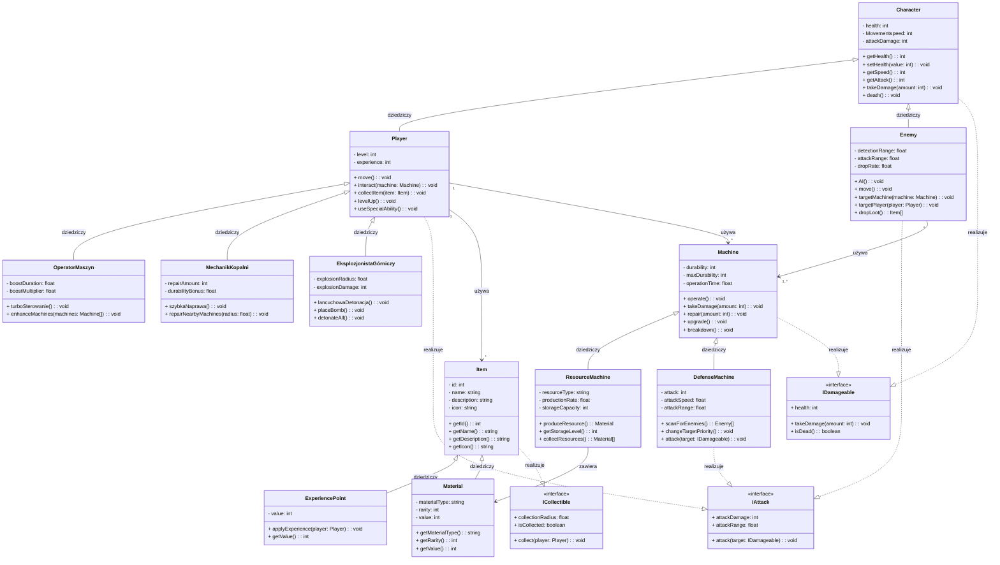

# Mine Survivors 🚇⛏️

**Mine Survivors** to dynamiczna gra akcji inspirowana tytułami takimi jak *Vampire Survivors* oraz *Brotato*. Akcja gry rozgrywa się w podziemnych korytarzach kopalń, gdzie wcielasz się w górnika eksplorującego tajemnicze tunele, zbierającego surowce oraz odpierającego fale przeciwników. Gra stanowi również świetną okazję do nauki programowania obiektowego i rozwoju portfolio.

## 📚 Spis treści

- [Opis projektu](#opis-projektu)
- [Cel projektu 🎯](#cel-projektu-)
- [Stack technologiczny 💻](#stack-technologiczny-)
- [Mechaniki rozgrywki 🎮](#mechaniki-rozgrywki-)
- [Interfejs użytkownika (UI) 🎮](#interfejs-użytkownika-)
- [Klasy postaci 👷‍♂️](#klasy-postaci-%EF%B8%8F)
- [Architektura kodu 🏗️](#architektura-kodu-%EF%B8%8F)
- [Diagram UML 🧜‍♀️](#diagram-uml-%EF%B8%8F)
- [Aktualizacje / Rozwój 🚀](#aktualizacje-)
- [Licencja 📄](#licencja-)

## Opis projektu

**Mine Survivors** to gra, w której wcielasz się w górnika eksplorującego kopalnie pełne niebezpieczeństw, surowców oraz przeciwników. W trakcie rozgrywki zarządzasz maszynami wydobywczymi i korzystasz z unikalnych umiejętności, aby przetrwać w podziemnym świecie. 🌌

## Cel projektu 🎯

- Nauka programowania obiektowego poprzez praktyczną implementację gry.
- Rozwój portfolio i prezentacja umiejętności w tworzeniu gier.
- Eksperymentowanie z silnikiem **Godot** oraz innymi technologiami.

## Stack technologiczny 💻

- **Silnik gry:** Godot Engine 4.4.1 (Mono) – wykorzystujemy wbudowany Godot API do obsługi logiki gry oraz zapisu i odczytu stanu gry.
- **Język programowania:** C#
- Zapis **ustawień** i **stanu gry** odbywa się za pomocą wbudowanego systemu Godota (ConfigFile i pliki .save)
- **Grafika:** Aseprite (pixel art, 2D top-down)
- **Audio:** Audacity (edycja dźwięków, chiptune 16-bit)
- **Narzędzia:** Visual Studio / Git, GitHub
- **Gotowe assety** Itch.io, Godot asset library
- **Wsparcie AI:** ChatGPT / OpenAI o1, OpenAI o3-mini

## Mechaniki rozgrywki 🎮

- **Poruszanie się:** Sterowanie postacią w ciasnych tunelach. 🏃‍♂️
- **Automatyczny atak:** Postać automatycznie strzela do przeciwników w zasięgu. 🔫
- **Awansowanie** Rozwijaj swojego bohatera zdobywając kolejne rangi aby odblokować lepszy sprzęt. ⏫
- **Maszyny wydobywcze:** Urządzenia generujące surowce, które przyciągają wrogów. ⚙️
- **Obrona maszyn:** Fale przeciwników atakują maszyny – wymaga strategicznego podejścia. 🛡️
- **Eksploracja kopalni:** Decyduj, czy chronić maszyny, czy ryzykować zejście na niższe poziomy, gdzie czekają cenniejsze surowce i trudniejsi przeciwnicy. 🌑

## Interfejs użytkownika (UI) 🎮

Interfejs użytkownika w **Mine Survivors** został zaprojektowany z myślą o intuicyjności i przejrzystości, zapewniając graczowi łatwy dostęp do kluczowych informacji.  W implementacji UI w Godot Engine istotne jest wykorzystanie **scen** dla każdego elementu interfejsu (menu, HUD itp.) oraz **sygnałów** do komunikacji między nimi, co sprzyja modularności i elastyczności.

Główne elementy interfejsu obejmują:

* **Menu Główne:**
    * Tytuł gry: "Mine Survivors".
    * Przyciski nawigacyjne:
        * "Start Game" - Rozpoczęcie nowej rozgrywki.
        * "Settings" - Dostęp do opcji konfiguracyjnych.
        * "Exit" - Zakończenie aplikacji.
* **HUD (Heads-Up Display):**
    * Prezentacja podstawowych statystyk postaci:
        * Zdrowie (Health).
        * Doświadczenie (EXP).
        * Zasoby (surowce i ich ilości).
* **Menu Pauzy:**
    * Wstrzymanie i wznowienie rozgrywki.
    * Dostępne akcje:
        * Wznów (Resume).
        * Ustawienia (Settings).
        * Powrót do Menu Głównego (Main Menu).
* **Menu Game Over:**
    * Wyświetlane po przegranej gracza.
    * Zawiera:
        * Komunikat o porażce.
        * Podsumowanie statystyk (opcjonalne).
    * Umożliwia:
        * Powrót do Menu Głównego (Main Menu).
        * Ponowną próbę (Restart) - opcjonalne.
* **Menu Ustawień:**
    * Konfiguracja opcji gry:
        * Głośność.
        * Rozdzielczość ekranu.
        * Sterowanie.

Wykorzystanie scen i sygnałów w Godot umożliwia modułową budowę UI, co ułatwia jego przyszły rozwój i modyfikacje.

## Klasy postaci 👷‍♂️

Gra oferuje trzy klasy postaci, z których każda specjalizuje się we współpracy z maszynami wydobywczymi:

1. **Operator Maszyn**
   *Specjalizacja:* Sterowanie maszynami wydobywczymi.
   *Zdolność specjalna – Turbo Sterowanie:* Tymczasowo zwiększa wydajność maszyn, co przekłada się na szybsze generowanie surowców oraz krótkotrwałą ochronę przed atakami przeciwników. ⚡

2. **Mechanik Kopalni**
   *Specjalizacja:* Naprawa i ulepszanie kopalnianych urządzeń.
   *Zdolność specjalna – Szybka Naprawa:* Natychmiast przywraca część wytrzymałości pobliskim maszynom, zwiększając ich odporność na uszkodzenia przez określony czas. 🔧

3. **Eksplozjonista Górniczy**
   *Specjalizacja:* Wykorzystanie kontrolowanych eksplozji do otwierania nowych przejść, niszczenia przeszkód oraz zadawania obrażeń przeciwnikom.
   *Zdolność specjalna – Łańcuchowa Detonacja:* Inicjuje sekwencję eksplozji, która osłabia wrogów oraz może ujawniać ukryte surowce lub przełamywać strukturalne bariery kopalni. 💥

## Architektura kodu 🏗️

### 📌 Paradygmat obiektowy

- **Struktura klas**
  - Klasa bazowa `Character` dla gracza i przeciwników (zdrowie, prędkość, atak).
  - `Player` dziedziczący po `Character` (sterowanie, interakcja z obiektami).
  -  Klasy postaci: `Operator Maszyn`, `Mechanik Kopalni` i `Eksplozjonista Górniczy` dziedziczą z `Player` i implementują unikalne zdolności specjalne.
  - `Enemy` jako klasa dziedzicząca (sztuczna inteligencja, wzorce ruchu).
  - `Machine` – klasa bazowa dla maszyn wydobywczych.
  - `ResourceMachine` i `DefenseMachine` jako klasy pochodne.
  - `Item` – klasa bazowa reprezentująca przedmioty dostępne w grze. Zawiera podstawowe właściwości, takie jak unikalny identyfikator, nazwa, opis oraz wizualną reprezentację (np. ikona), umożliwiającą jednolite zarządzanie wszystkimi przedmiotami.
  - `ExperiencePoint` – klasa dziedzicząca po `Item`, reprezentująca punkty doświadczenia. Po zebraniu przez gracza automatycznie zwiększa zdobywany poziom doświadczenia, wpływając na rozwój postaci oraz odblokowywanie nowych umiejętności.
  - `Material` – klasa dziedzicząca po `Item`, reprezentująca surowce. Materiały mogą być wykorzystywane do ulepszania maszyn, budowy struktur.

- **Dziedziczenie**
- Klasy postaci (`Operator Maszyn`, `Mechanik Kopalni`, ` Eksplozjonista Górniczy`) dziedziczą z `Player` i rozszerzają możliwości poprzez swoje zdolności specjalne.
  - Przeciwnicy dziedziczą wspólne cechy z klasy `Enemy`, ale różnią się zachowaniem i AI.
  - Różne typy maszyn dziedziczą z klasy `Machine`, dostosowując funkcjonalności do konkretnych zadań.
  - Klasy `ExperiencePoint` oraz `Material` dziedziczą z klasy `Item`, ujednolicając sposób przechowywania oraz interakcji z przedmiotami w grze.

- **Polimorfizm**
  - Wspólny interfejs `IDamageable` pozwala na jednolite traktowanie wszystkich obiektów podatnych na obrażenia.
  - Interfejs `IAttack` definiuje sposób ataku (strzały, walka wręcz, eksplozje).
  - nterfejs `ICollectible` umożliwia spójny mechanizm zbierania przedmiotów przez gracza.

- **Hermetyzacja**
  - Kluczowe zmienne, takie jak `health` czy `damage`, są prywatne i dostępne wyłącznie poprzez gettery/settery, co zapewnia kontrolę nad modyfikacją wartości.
  - Właściwości klas dziedziczących po `Item` są chronione, co pozwala na bezpieczną modyfikację ich stanów podczas rozgrywki.

## Diagram UML 🧜‍♀️

Diagram przedstawia relacje między klasami w grze oraz wykorzystanie paradygmatów programowania obiektowego.

## Aktualizacje / Rozwój 🚀

Poniżej znajduje się lista aktualnych postępów oraz planowanych kierunków rozwoju **Mine Survivors**. Pamiętaj, że plany mogą ulec zmianie w trakcie tworzenia gry.

**Legenda:**

* ✅ - Zaimplementowane
* 🚧 - W trakcie implementacji
* ⏳ - W trakcie planowania
* ❓ - Do rozważenia

### Lista aktualnych postępów

* ✅   Utworzenie projektu
* ✅   Stworzenie i podłączenie się do repozytorium zdalnego
* ✅   Integracja silnika **Godot** z systemem kontroli wersji **git**
* ✅   Konfiguracja projektu (ustawienia wyświetlania, domyślne ustawienia sterowania, warstwy fizyki)
* ✅   Utworzenie klasy głównej `Character` z implementacją podstawowych metod
* ✅   Utworzenie klasy `Player` z obsługą sterowania
* ✅   Utworzenie klasy `Enemy` goniącego za `Player`
* ✅   Implementacją utworzonych klas w silniku

### Lista planowanych zadań

* ⏳   Utworzenie interfejsów `IAttack` oraz `IDamageable`
* ⏳   Implementacja **systemu walki** opartego na interfejsach
* ⏳   Zaimportowanie i konfiguracja *TileSet*
* ⏳   Utworzenie pierwszego grywalnego poziomu
* ⏳   Utworzenie klasy `Item`
* ⏳   Utworzenie interfejsu `ICollectible`
* ⏳   Utworzenie i implementacja klasy `ExperiencePoint`
* ⏳   Utworzenie i implementacja klasy `Material`
* ⏳   Utworzenie scen **Interfejsu**
* ⏳   Stworzenie **klas postaci** z ich **unikalnymi umiejętnościami**

### Lista rozważanych mechanik i funkcjonalności (opcjonalne)

* ❓   System broni opartych na klasie `Weapon` - Dodanie różnorodności w walce i taktyki.
* ❓   System maszyn wydobywczych, działek, piecy - Rozbudowa ekonomii i obrony bazy.
* ❓   Zarządzanie stanami postaci klasy `Character` za pomocą State Machine - Poprawa płynności i złożoności zachowań postaci.
* ❓   System oświetlenia i ciemności inspirowany **Bullet Echo** - Zwiększenie napięcia i elementu zaskoczenia.
* ❓   Proceduralne generowanie poziomów - Zapewnienie regrywalności i unikalnych wyzwań.

## Licencja 📄

Projekt **Mine Survivors** jest udostępniony na licencji MIT. Pełna treść licencji znajduje się w pliku [LICENSE](LICENSE).

---

Dziękujemy za zainteresowanie projektem! Śledź postępy oraz zgłaszaj swoje sugestie na GitHub! 🚀
